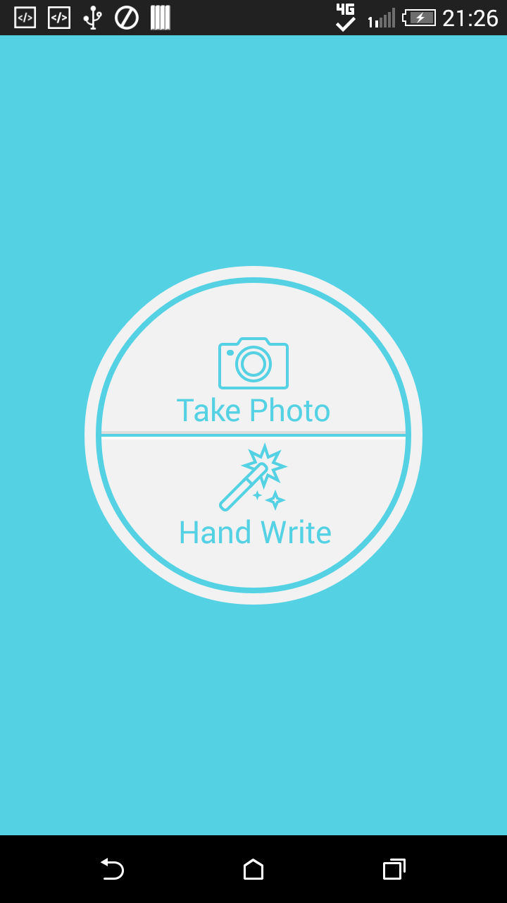

RingButton
================
RingButton is a button with two parts. Each part has its text, icon and click event.

Supported on API Level 7 and above.



Usage
====
gradle

```groovy
compile 'com.victor.ringbutton:lib:1.0.1'
```

Add RingButton to your xml and change the style with its attrs.

```xml
  <com.victor.ringbutton.RingButton
        android:id="@+id/ringButton"
        app:upText="Take Photo"
        app:downText="Hand Write"
        app:upDrawable="@drawable/take_photo"
        app:downDrawable="@drawable/hand_write"
        android:layout_centerInParent="true"
        android:layout_width="240dp"
        android:layout_height="240dp"/>

```

Set the clicklistener to RingButton.

```java
 ringButton.setOnClickListener(new RingButton.OnClickListener() {
            @Override
            public void clickUp() {
                Toast.makeText(getApplicationContext(), "Click up", Toast.LENGTH_SHORT).show();
            }

            @Override
            public void clickDown() {
                Toast.makeText(getApplicationContext(), "Click down", Toast.LENGTH_SHORT).show();
            }
        });

```


License
=======
Copyright 2015 yankai-victor

Licensed under the Apache License, Version 2.0 (the "License"); you may not use this work except in compliance with the License.
You may obtain a copy of the License in the LICENSE file, or at:

http://www.apache.org/licenses/LICENSE-2.0

Unless required by applicable law or agreed to in writing, software distributed under the License is distributed on an "AS IS" BASIS, WITHOUT WARRANTIES OR CONDITIONS OF ANY KIND, either express or implied. See the License for the specific language governing permissions and limitations under the License.
